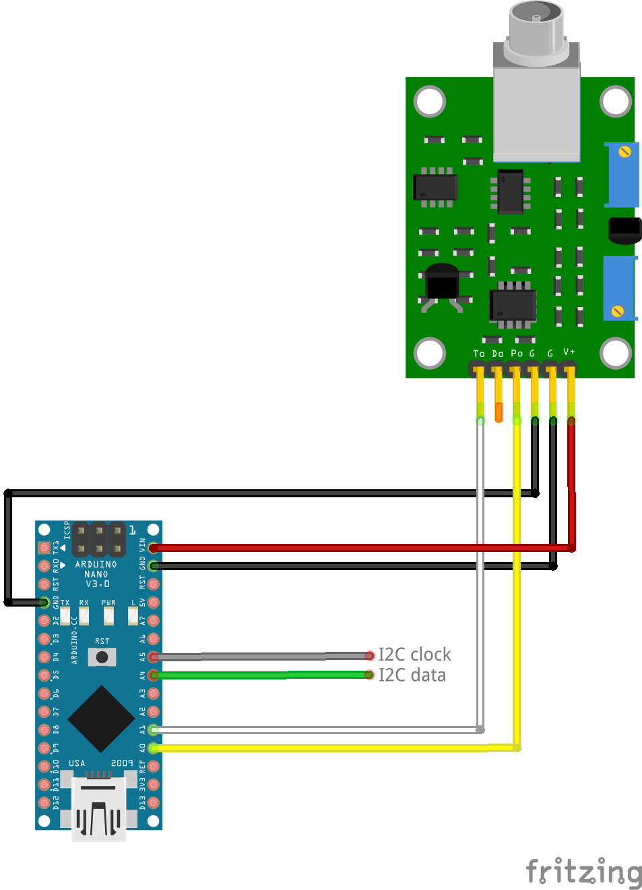

 With this project you can easily interface your Arduino and PH-4502C Sensor as a PH-EZO sensor.
 
 Why ? 
 
 Because I need it working on my reef-pi setup and reef-pi contributors does not provide driver code for writing a custom ph module reader.
 
 First of all need to calibrate PH-4502C board, put the sensor on a PH 7  buffer solution and rotate the potentiometer near the BNC connector until you read 2.5V (if supply voltage is 5V)
 
 Features: 
    - 1,2,3 Calibration points
    - Temperature compensation
    - Factory reset by wire or by PIN
    - EEPROM management for calibration, I2C address and Compensation temperature storage
    - PH and Temperature readings with floating average
    - LED for board identification
	
Step-by-Step Instructions for Wiring
Components Needed:

    Arduino Nano
    PH4502C pH sensor module
    pH probe (compatible with PH4502C)
    Jumper wires
    Breadboard (optional for organizing connections)

Wiring Instructions:

    Power Connections:
        PH4502C VCC to Arduino Nano 5V: Connect the VCC pin on the PH4502C module to the 5V pin on the Arduino Nano.
        PH4502C GND to Arduino Nano GND: Connect the GND pin on the PH4502C module to a GND pin on the Arduino Nano.

    Signal Connections:
        PH4502C VOUT to Arduino Nano A0: Connect the VOUT pin on the PH4502C module to the A0 analog pin on the Arduino Nano. This is where the pH reading signal will be sent.
        PH4502C GND: Ensure that the PH4502C GND is connected to the common ground with the Arduino to avoid any ground loop issues.

    Optional Connections (if you need to control the PH4502C module features):
        PH4502C T1/T2: These are used for calibrating the pH sensor and might require additional wiring depending on your calibration method, but they are not usually connected to the Arduino.
        PH4502C LED: Some modules have an LED pin that can be connected to a digital pin on the Arduino if you want to control the onboard LED.
		
